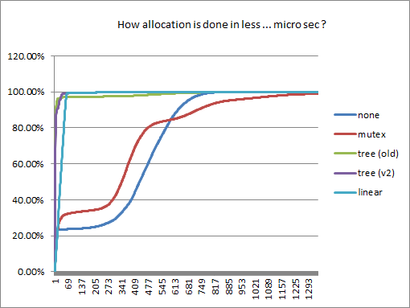
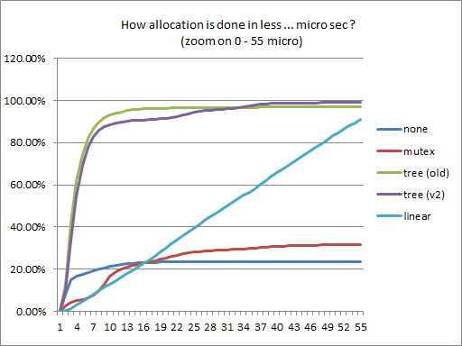
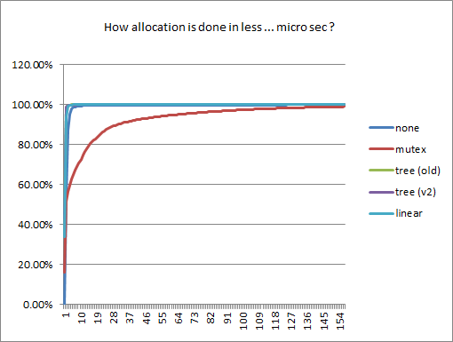
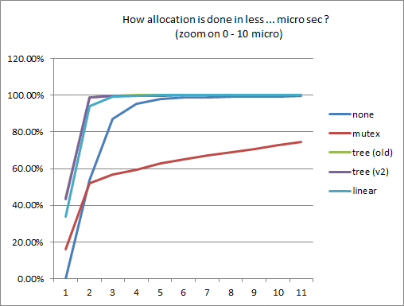
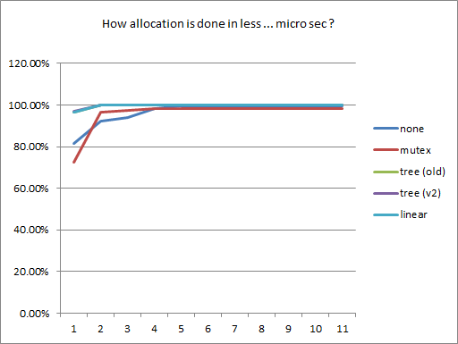
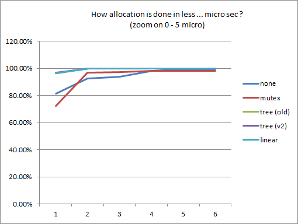
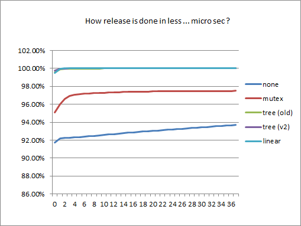
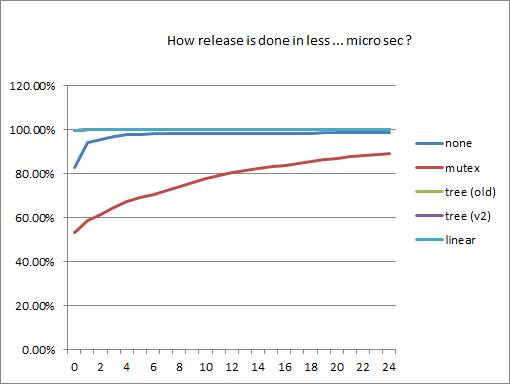
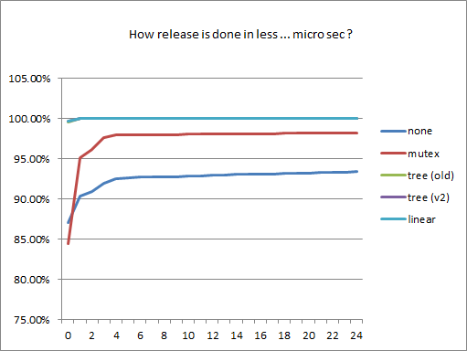

# Test case

It is a basic producer/consumer test and communication between producer and consumer is done via queue.  There are :
* N thread(s) create item with object pool :

  ```c++
  void producer(Queue& queue, Pool& pool, std::size_t n)
  {
    for(std::size_t i = 0; i < n ; ++i)
    {
      auto item = pool.acquire();
      queue.push(std::move(item));
    }
  }
  ```

* M thread(s) release item :

  ```c++
  void consumer(Queue& queue, Pool& pool, bool &stop)
  {
    typename Queue::value_type v;
    while(!stop)
    {
      queue.pop(v);
      v.reset();
    }
  }
  ```

# What is measured ?

* item's allocation (min/max/avg)
* item's release (min/max/avg)
* time to process the benchmark
* memory

# Algorithm

* none : acquire call `new` and when object is not needed it will be deleted
* mutex + list : a list of free objects is created protected by a mutex. acquire/release need to lock mutex :

  ```c++
  ptr acquire( ARGS ... args)
  {
     lock_guard guard(mutex_);    
     if(free_item.empty())
     {
       return get_free_item_(args...);
     }
     else
     {
       return create_new_item_(args...);
     }
  }
  ```

* segment linear : it is a one way chain list of segment. A segment is a simple memory pool but each memory block are always same size and return nullptr if allocation is not possible. If allocate is not possible, a new segment will be created if not exist and the process continue on the next segment :

  ```c++
  struct node
  {
    segment segment_;
    node*   next_;
  };

  node root_

  ptr acquire( ARGS ... args)
  {
    return acquire_(root_, args...);
  }

  ptr acquire_(node &n, ARGS ... args)
  {
    void* data = n.segment_.acquire();
    if(data)
    {
      return create_ptr_(data, args...);
    }
    else
    {
      if(!n.next_)
      {
        n.next_ = new node();
      }
      return acquire_(*n.next_, args...);
    }    
  }
  ```
  
  _segment linear_ is full lockfree (acquire / release) and support multi acquire and release in same time.
 
* segment tree (old and v2) : it is very closed to _segment linear_ but is is a tree of segment :

  ```c++
  struct node
  {
    segment segment_;
    node*   childs_[64];
  };

  node root_

  ptr acquire( ARGS ... args)
  {
    return acquire_(root_, args...);
  }

  ptr acquire_(node &n, ARGS ... args)
  {
    void* data = n.segment_.acquire();
    if(data)
    {
      return create_ptr_(data, args...);
    }
    else
    {
      node* next = find_next_child_(n);
      return acquire_(*next, args...);
    }    
  }
  ```

  the main difference between the two version if _segment tree_ is the predicate to find the best child.

  * old version, it is sequential :

  ```c++

  struct node
  {
    segment segment_;
    node*   childs_[64];
    int     last_acquire_id_; // value 0 <-> 63
  };

  node* find_next_child_(node& n)
  {
     int id = n.last_acquire_id_;
     n.last_acquire_id_ = (n.last_acquire_id_ + 1) % 64;
     if(!n.child_[id])
     {
       n.child_[id] = new node();
     }
     return n.child_[id];
  }

  ```

  * new version, the predicate try to find child with free element(s) otherwise child with minimum child :

  ```c++

  struct node
  {
    segment segment_;
    node*   childs_[64];

    // return nb free item on the segment + nb free element on each child
    int size() 
    {
      int ret = segment_.size();
      for(node* child : childs_)
      {
        if(child) {ret += child->size();}
      }
      return ret;
    }

    // return nb childs
    int get_nb_child()
    {
      int ret = 0;
      for(node* child : childs_)
      {
        if(child) {ret += 1 + child->get_nb_child();}
      }
      return ret;
    }
  };

  node* find_next_child_(node& n)
  {
     for(node* child : n.childs_)
     {
       if(child && (child -> size() != 0))
       {
          return child;
       }
     }

     int id = 0;
     int id_min = 0;
     int nb_min_child = +inf;
     for(node* child : n.childs_)
     {
       if(child)
       {
         int nb_child = child.get_nb_child();
         if(nb_child < nb_min_child)
         {
           id_min       = id;
           nb_min_child = nb_child ;
         }
       }
       else
       {
         id_min       = id;
         nb_min_child = 0;
       }
       ++id;
     }

     node *& next = n.childs_[id];
     if(!next)
     {
       next = new node();
     }
     return next;
  }

  ```

  _segment tree_ is full lockfree (acquire / release) and support multi acquire and release in same time.

# Comparaison

## Variables

Nb producer (N) | Nb consumer (M)
:--------------:| :-------------:
1               | 30
30              |  1
15              | 15

## Static

* Item size is 10240 octets.
* Each producer create & send 100000 items

## Which computer ?

* linux (Red Hat 6.7)
* g++ (4.8.2-15)
* 2 processors (_Intel(R) Xeon(R) CPU E5-2667 v2 @ 3.30GHz_) and 8 cores
* 32 Go memory
* 64-bit binary

## global

### N=30 and M=1

algorithm  | Time to process (Ms) | Nb items in pool
-----------|---------------------:|----------------:
none       |                40601 | 0
mutex+list |                34768 | 2636101
linear     |                 6607 | 50368
tree (old) |                 4108 | 5153856
tree (new) |                 3879 | 309696

### N=15 and M=15

algorithm  | Time to process (Ms) | Nb items in pool
-----------|---------------------:|----------------:
none       |                 3402 | 0
mutex+list |                 2737 | 284
linear     |                 2332 | 2176
tree (old) |                 2285 | 4160
tree (new) |                 2269 | 2880

### N=1 and M=30

algorithm  | Time to process (Ms) | Nb items in pool
-----------|---------------------:|----------------:
none       |                 2029 | 0
mutex+list |                 2058 | 13
linear     |                 1905 | 64
tree (old) |                 1970 | 64
tree (new) |                 2011 | 64

## memory allocation

### N=30 and M=1

algorithm  | Min (micro) | Max (micro) | Avg (Micro)
-----------|------------:|------------:|-----------:
none       |           0 |       13921 | 373
mutex+list |           0 |       16841 | 332
linear     |           0 |       12125 | 33
tree (old) |           0 |       12726 | 23
tree (new) |           0 |       14984 | 14





### N=15 and M=15

algorithm  | Min (micro) | Max (micro) | Avg (Micro)
-----------|------------:|------------:|-----------:
none       |           0 |      172928 | 3
mutex+list |           0 |       14559 | 13
linear     |           0 |         656 | 1
tree (old) |           0 |         657 | 0
tree (new) |           0 |         554 | 1





### N=1 and M=30

algorithm  | Min (micro) | Max (micro) | Avg (Micro)
-----------|------------:|------------:|-----------:
none       |           0 |        2036 | 2
mutex+list |           0 |       22725 | 4
linear     |           0 |        2955 | 0
tree (old) |           0 |        1307 | 0
tree (new) |           0 |        1099 | 0





## memory release

### N=30 and M=1

algorithm  | Min (micro) | Max (micro) | Avg (Micro)
-----------|------------:|------------:|-----------:
none       |           0 |       13921 | 373
mutex+list |           0 |       11659 | 11
linear     |           0 |          16 | 0
tree (old) |           0 |         667 | 0
tree (new) |           0 |        3611 | 0



### N=15 and M=15

algorithm  | Min (micro) | Max (micro) | Avg (Micro)
-----------|------------:|------------:|-----------:
none       |           0 |      172928 | 3
mutex+list |           0 |       11843 | 11
linear     |           0 |         840 | 0
tree (old) |           0 |         840 | 0
tree (new) |           0 |         611 | 0



### N=1 and M=30

algorithm  | Min (micro) | Max (micro) | Avg (Micro)
-----------|------------:|------------:|-----------:
none       |           0 |        2036 | 2
mutex+list |           0 |        1615 | 5
linear     |           0 |          89 | 0
tree (old) |           0 |        1307 | 0
tree (new) |           0 |        1099 | 0



# Conclusion

* segment algo are faster in allocation and release than reference algo,
* between the segment algo
	* the fastest allocation algo is `tree (new)` but with a lot of simultaneous access, 
	* this memory usage is more important than `linear`,
	* there is no big difference to release
* `tree (old)` and `mutex+list` have a memory over consumption

# Evolution

* add little sleep in segment algo when atomic/compare_exchange_weak failed

# Links
[source] (../tests/perf_object_pool_01.cc)
